# Architecture

This document provides a detailed overview of repo-sherpa's system architecture, design patterns, and component interactions.

## System Overview

repo-sherpa is a multi-bot service that runs multiple independent Slack bot instances from a single process. Each bot serves a specific git repository and maintains conversation context through Slack threads, integrating with Claude Code CLI for AI-powered codebase analysis.

## High-Level Architecture


## Request Flow

The complete request lifecycle from Slack mention to AI response:


### Flow Steps

1. **Mention Received**: User mentions bot in Slack channel
2. **Visual Feedback**: Bot adds random emoji reaction from configured list
3. **Async Job Submission**: Request submitted to ThreadPoolExecutor
4. **Thread Context Fetch**: Retrieve conversation history from Slack API
5. **Prompt Formatting**: Combine conversation history with repo path
6. **Claude CLI Invocation**: Execute `claude` command in repository directory
7. **Response Parsing**: Parse JSON output and extract session ID
8. **Session Storage**: Map thread timestamp to session ID for continuity
9. **Response Posted**: Send AI response to Slack thread
10. **Cleanup**: Remove emoji reaction

## Core Components

### MultiRepoBot Class

Located in `src/bot.py:23`, this is the central orchestrator.


**Key Attributes:**

- `thread_sessions`: Maps `thread_ts` → `session_id` for conversation continuity
- `executor`: ThreadPoolExecutor with max_workers=10 for concurrent processing
- `apps`: Dict of bot_name → `{app, config}` pairs
- `handlers`: Event handler closures (one per bot)

### Session Management

Session management enables multi-turn conversations:

```mermaid
graph LR
    A[First message in thread] -->|No session_id| B[Create new Claude session]
    B --> C[Store: thread_ts → session_id]
    D[Subsequent message] -->|thread_ts exists| E[Resume with --resume session_id]
    E --> F[Claude remembers context]
```



**Implementation Details:**

- Thread IDs extracted from `event['thread_ts']` (fallback to `event['ts']`)
- Sessions stored in-memory only (lost on restart)
- First message: New session started
- Follow-up messages: Existing session resumed via `--resume session_id`

### Closure Pattern for Handlers

Each bot instance gets its own event handler closure:

```python
def _make_app_mention_handler(self, bot_name, bot_config):
    """Create a handler closure with bot_name and bot_config in scope"""
    def handler(event, say, client):
        # bot_name and bot_config captured in closure
        thread_ts = event.get('thread_ts') or event['ts']
        # ... processing logic
    return handler
```

**Benefits:**

- Bot-specific configuration captured in closure scope
- No need to pass bot_name through request chain
- Each handler has access to its bot's config
- Clean separation between bot instances

### Async Processing

ThreadPoolExecutor enables concurrent request handling:


**Configuration:**

- `max_workers=10`: Up to 10 concurrent requests
- Each request runs in background thread
- Slack event returns immediately with emoji reaction
- Actual processing happens asynchronously

## Data Flow

### Prompt Formatting

The `format_prompt()` method builds the conversation context:


**Example prompt structure:**

```
[Previous messages from thread...]

User: How does the authentication system work?
Repository: /path/to/repo

[Claude CLI will analyze the repo and respond]
```

### Claude CLI Integration

The bot invokes Claude Code CLI as a subprocess:

```bash
cd /path/to/repo && claude --json "user prompt here"
```

**Response format:**

```json
{
  "response": "AI-generated response text",
  "session_id": "claude-session-uuid"
}
```

**Resume flow:**

```bash
cd /path/to/repo && claude --json --resume session-id "follow-up question"
```

## Configuration Structure

### bot_config.yaml

```yaml
bots:
  backend:
    repo_path: "/absolute/path/to/repo"  # Git repository path
    timeout: 300                         # Request timeout (seconds)
    processing_emojis:                   # Visual feedback options
      - eyes
      - robot_face
```

### Environment Variables

```bash
# Naming convention: {BOT_NAME}_BOT_TOKEN and {BOT_NAME}_APP_TOKEN
BACKEND_BOT_TOKEN=xoxb-bot-token
BACKEND_APP_TOKEN=xapp-app-token
```

## Error Handling

Three categories of errors are explicitly handled:


**Timeout Handling:**

- Configurable per-bot (default: 300 seconds)
- Prevents runaway Claude CLI processes
- User notified if timeout occurs

**JSON Parsing:**

- Claude CLI output must be valid JSON
- Parse errors logged and reported to user
- Suggests checking Claude CLI installation

## Thread Safety

The system uses several patterns to ensure thread-safe operation:


**Thread-safe components:**

- `thread_sessions` dict: Protected by Python GIL
- ThreadPoolExecutor: Built-in thread-safe job queue
- Slack clients: One per bot, no shared state

## Visual Feedback System

Emoji reactions provide real-time status updates:

```mermaid
stateDiagram-v2
    [*] --> Processing: Add emoji (random from list)
    Processing --> Complete: Remove emoji on success
    Processing --> Error: Remove emoji on failure

    note right of Processing
        User sees bot is "thinking"
        Random emoji from config:
        - eyes 👀
        - robot_face 🤖
        - wave 👋
    end note
```



**Configuration:**

```yaml
processing_emojis:
  - eyes
  - robot_face
  - wave
```

Each request randomly selects one emoji from the list, adding variety to the user experience.

## Logging Strategy

Comprehensive logging with timestamps:

```python
logging.basicConfig(
    level=logging.INFO,
    format='%(asctime)s - %(name)s - %(levelname)s - %(message)s',
    datefmt='%Y-%m-%d %H:%M:%S'
)
```

**Log levels used:**

- `INFO`: Request received, bot configured, response sent
- `WARNING`: Missing tokens, failed emoji reactions
- `ERROR`: API failures, CLI invocation errors
- `DEBUG`: Thread context fetching, emoji reactions

## Limitations and Considerations

### In-Memory Sessions

- **Current**: Session IDs stored in-memory
- **Impact**: Sessions lost on service restart
- **Trade-off**: Simplicity vs persistence
- **Future enhancement**: Redis/database for persistence

### Claude CLI Dependency

- **Requirement**: Claude Code CLI must be installed
- **Version**: Must match compatible CLI version
- **Network**: Requires internet connection for Claude API

### ThreadPoolExecutor

- **Max workers**: 10 concurrent requests
- **Tuning**: Adjust based on Claude CLI performance
- **Resource limits**: Each worker spawns a subprocess

### Socket Mode

- **Pros**: No public endpoint needed
- **Cons**: Requires persistent connection
- **Scaling**: May need HTTP mode for high-traffic deployments

## Security Considerations

1. **Token Storage**: Use `.env` file (gitignored)
2. **Token Scopes**: Minimal required permissions
3. **Repo Access**: Ensure bot has file system read access
4. **Session Isolation**: Per-thread sessions prevent cross-talk
5. **Timeout Protection**: Prevents resource exhaustion

## Performance Characteristics

- **Async Processing**: Slack events return immediately (<100ms)
- **Thread Pool**: Up to 10 concurrent Claude CLI invocations
- **Session Continuity**: No re-analysis needed for follow-ups
- **Visual Feedback**: Emoji reaction within 500ms
- **Typical Response**: 5-30 seconds depending on query complexity
